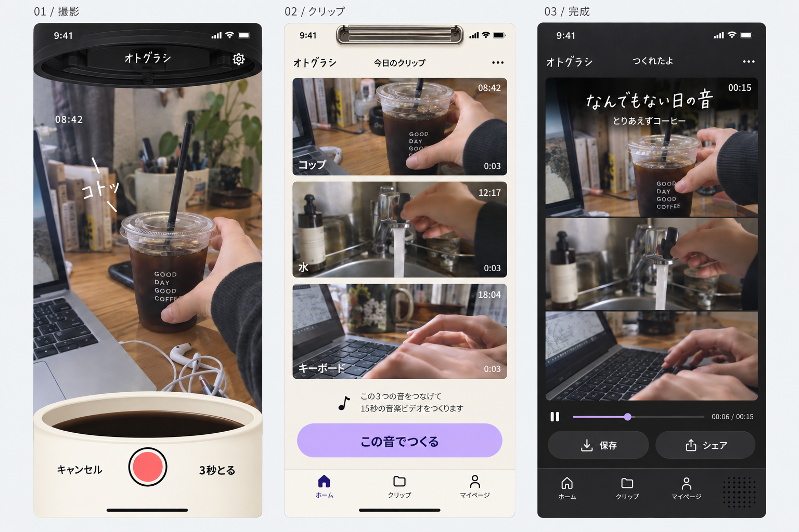

# オトグラシ / OtoGrashi

いつもの物を3つ撮ると、その音でできた、自分の15秒が生まれる。

## 現在の状態

FlutterとiOSネイティブ処理で実装中です。撮影・取り込み、編曲、15秒動画生成、再生と作品編集のコードがあります。共有・リミックスは引き続き実装対象です。
実機確認にはGitHub Actionsの署名なしRelease IPAをダウンロードし、WindowsのiLoaderで署名・インストールします。TestFlight対応は後日です。
Androidへの再利用は考慮しますが、初版のビルド・実機テストはiOSのみです。

- [製品・体験・技術設計](docs/superpowers/specs/2026-09-21-otogurashi-ios-design.md)
- [実装計画](docs/superpowers/plans/2026-09-22-otogurashi-ios-implementation.md)
- [iLoader向けIPAのダウンロード方法](docs/delivery/unsigned-ipa.md)
- [ビルド環境](docs/delivery/build-environment.md)
- [UI方向性の参考画像](docs/design/approved-direction-reference.png)

サウンドと映像がセットで変わるエフェクトは初版後の追加機能です。
サブエージェントはユーザー許可のLuna/maxとSol/mediumに限定します。
