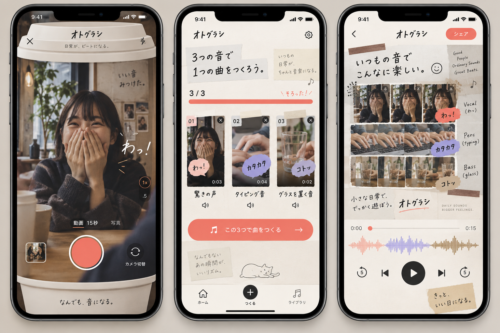

# 日常の音を集める UI 参照 v1

ImageGen の `ui-mockup` で作成した参照画像。完成 UI ではなく、実機画面に再現するための視覚的な方向性として扱う。画像内の文字や操作はそのまま実装しない。

## 守る要素

- 友達の声、タイピング、コップなど、実際に撮った場面を画面の主役にする。
- 紙片、薄いテープ、手書きの擬音で、短編動画の編集に近い親しみを出す。
- 撮影画面だけに、画面内に収まる開いたカップの蓋と縁を使う。左右にカップの枠を置かない。ほかの画面へカップ意匠を広げない。
- 素材の収集、曲になった映像、波形を一続きの体験として見せる。操作の明瞭さと44pt以上のタップ領域を保つ。

## 生成プロンプト

> Use case: ui-mockup. Create one high-fidelity art-direction reference board showing THREE distinct vertical iPhone app screens side by side for a Japanese social music-video maker called オトグラシ. The product turns short real-life videos and their original sounds (a friend's surprised 'わっ' reaction, typing fingers, a glass placed on a desk) into a playful 15-second beat and shareable video. Screen 1: camera recording interface, full-screen candid camera footage as the substance of the UI; ONLY this screen has the upper edge shaped like an opened takeaway coffee lid and the lower edge shaped like the cup's top rim, all fitting INSIDE the phone screen, no cup extending along the left or right side. A visible front/back camera-switch control and warm coral record control. Screen 2: collection screen of three user clips with real candid thumbnail frames and charming hand-cut stickers; a clear 3/3 progress treatment and one strong make-music action. NO cup motif here. Screen 3: video/music preview with a dynamic irregular MAD-style collage where one video multiplies into small tiles, another is a sustained bass-line strip, another flips to form melody; visible waveform and concise playback controls; NO cup motif here. Art direction: contemporary Japanese short-form video edit aesthetic similar to a creator's informal setlog, with imperfect paper cuts, little handwritten sound annotations, translucent tape, playful micro-color accents coral/lavender/coffee brown, tactile layered surfaces, deliberately not futuristic or sleek. Preserve realistic iOS touch targets, coherent app IA, readable hierarchy, and enough negative space. Device screens must be plausible usable UI, not posters. Show the three phones on a quiet neutral background. Avoid generic gradient dashboards, glossy 3D, anime mascot, long paragraphs of text, or giant physical props. Japanese UI text may be approximate; overall layout and visual grammar matter most.
