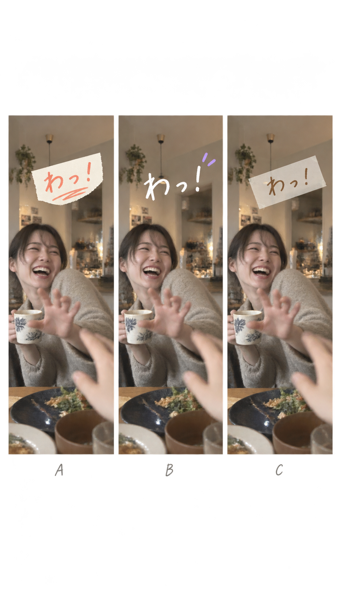

# 音に合わせて出る短いひとこと

ImageGen の `ui-mockup` で作成した比較画像。生成結果の B を参照し、任意の短い文字を映像の上に白く置き、薄紫の小さな線だけを添える。友達や生活の場面を隠す大きな枠は使わない。これは見た目の参考であり、実際の字幕位置・可読性・表示時間は書き出した動画で確認する。

現時点の操作は「動画にひとこと足す」から入力し、曲の入りに約1.5秒だけ表示する。文字を入れなくても曲を完成・共有できる。

## 生成プロンプト

> Use case: ui-mockup. Create one polished design-reference board with THREE side-by-side 9:16 exported-video frames (not phone bezels, not app controls) for オトグラシ, a Japanese app that turns real everyday video sounds into a 15-second music video. All three frames use the SAME candid scene: an adult friend suddenly laughing and saying 'わっ!' in a lived-in warm apartment, photographed like authentic handheld iPhone footage. Compare three tasteful treatments for a very short on-beat Japanese sound word sticker reading exactly 『わっ！』: left = hand-cut cream paper label with one coral scribble; middle = loose hand-drawn white lettering directly on footage with a tiny lavender beat mark; right = translucent taped note with warm coffee-brown text. Keep the face unobstructed, text within the central safe 70% of each frame, lots of moving-image space, readable on both light and dark areas. The mood is playful Japanese short-video/setlog editing, imperfect but restrained, made for sharing with friends, not sleek, futuristic, anime, comic-book, or advertising. The sticker is an optional brief accent timed to the actual sound, not a persistent subtitle. Label each treatment subtly underneath the frames as A/B/C outside the video area. Avoid extra copy or UI widgets.
